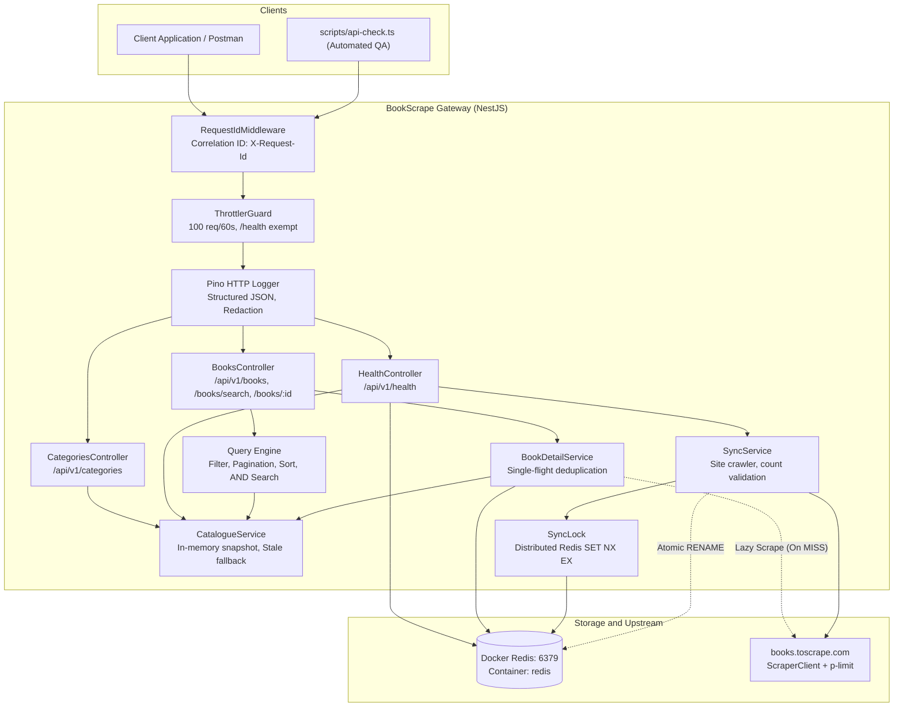
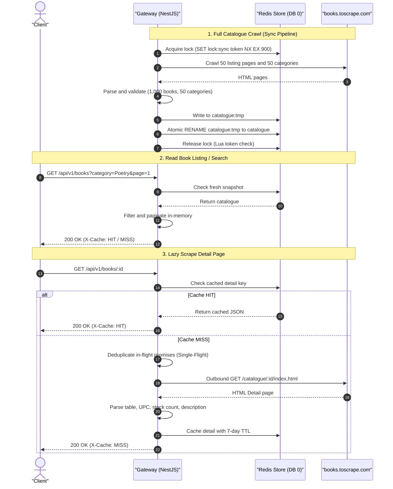

# BookScrape Gateway API

<p align="center">
  
  
  
  
  
  
</p>

<p align="center">
  <b>Author:</b> Sandeep Kumar &nbsp;|&nbsp;
  <a href="mailto:sandeepkumarnitrr@gmail.com"></a> &nbsp;|&nbsp;
  <a href="https://www.linkedin.com/in/sandeep-kumar-s21" target="_blank"></a>
</p>

Production-grade NestJS RESTful API reverse-engineering [books.toscrape.com](https://books.toscrape.com) into a high-performance, structured e-commerce catalogue tailored for payment gateway integration (such as Razorpay in INR). Built with atomic distributed Redis synchronization, single-flight request deduplication, multi-token search ranking, automated health diagnostics, and strict resilience fallbacks.

---

## 1. Tech Stack

| Technology | Logo / Badge | Version | Role in Project |
|---|---|---|---|
| **NestJS** |  | `^11.0` | Core application framework, dependency injection, modular controllers & services |
| **TypeScript** |  | `^5.7` | Static type safety across parsers, DTOs, and domain entities |
| **Redis** |  | `7-alpine` | Key-value store for catalogue snapshots, cached book details, and distributed lock |
| **ioredis** |  | `^5.4` | High-performance Redis client with Lua atomic script execution |
| **Cheerio** |  | `^1.0` | Fast, lightweight server-side DOM parsing and selector extraction |
| **p-limit** |  | `^6.2` | Concurrency throttling and politeness delay for outbound scraping |
| **Zod** |  | `^3.24` | Strict environment variable schema validation at application bootstrap |
| **nestjs-pino** |  | `^4.3` | High-speed structured JSON logging with automatic `X-Request-Id` correlation |
| **Throttler** |  | `^6.7` | Rate limiting per IP (100 req/min) to prevent gateway denial-of-service |
| **Vitest** |  | `^4.1` | Fast unit, contract, and end-to-end integration test runner |
| **Docker** |  | `Multi-stage` | Containerized standalone Redis and unprivileged production app image |

---

## 2. Architecture & Data Flow

### 2.1 System Architecture



### 2.2 Data Flow Diagram



---

## 3. Project File Structure

```
bookscrape-gateway/
├── .github/
│   └── workflows/
│       └── ci.yml                     # Continuous integration workflow (typecheck, lint, test, cov)
├── docker-compose.yml                 # Full stack Compose (App + Redis on bookscrape-net)
├── docker-compose.redis.yml           # Standalone Redis service (container_name: redis)
├── Dockerfile                         # Multi-stage production build (Node 22 Alpine, non-root)
├── docs/
│   ├── LIMITATIONS.md                 # Technical limitations note & long-term architectural remedies
│   └── SITE_ANALYSIS.md               # Upstream HTML structure, trap analysis, robots.txt audit
├── postman_collection.json            # Ready-to-import Postman Collection v2.1 (all endpoints & tests)
├── scripts/
│   └── api-check.ts                   # Autonomous test script validating all 16 acceptance criteria
├── src/
│   ├── app.controller.ts              # Root controller
│   ├── app.module.ts                  # Root application module with Throttler & Logger
│   ├── app.service.ts                 # Root service
│   ├── main.ts                        # Application bootstrap, Swagger setup, global filters
│   ├── sync-cli.ts                    # Standalone CLI synchronization entrypoint
│   ├── common/
│   │   ├── config/                    # Zod validated configuration module & service
│   │   ├── errors/                    # AppError hierarchy & AllExceptionsFilter (standard error envelope)
│   │   ├── http/                      # FetchTransport, ScraperClient (retry, backoff, SSRF guard)
│   │   ├── middleware/                # RequestIdMiddleware (X-Request-Id correlation)
│   │   ├── store/                     # KeyValueStore interface, RedisStore, InMemoryStore
│   │   └── utils/                     # HTML parsing utilities, URL resolution, ID regex
│   └── modules/
│       ├── books/                     # Books controller, detail service, parsers, DTOs
│       ├── catalogue/                 # CatalogueService, QueryEngine (filter, sort, search)
│       ├── categories/                # Categories controller, category page parsers, DTOs
│       ├── health/                    # HealthController (Redis ping, latency, crawler status)
│       └── sync/                      # SyncService, SyncLock (distributed lock), AutoSyncService
└── test/
    ├── app.e2e-spec.ts                # App boot e2e test
    ├── books-detail.e2e-spec.ts       # Book detail & lazy scrape e2e test
    ├── books-list.e2e-spec.ts         # Books listing, pagination, filters e2e test
    ├── books-search.e2e-spec.ts       # Title search & ranking e2e test
    ├── categories.e2e-spec.ts         # Categories & book count sum e2e test
    ├── health.e2e-spec.ts             # Health check e2e test
    ├── throttling.e2e-spec.ts         # Rate limiter 429 e2e test
    ├── contract/                      # RedisStore & InMemoryStore contract tests
    ├── fixtures/mini-site/            # Recorded HTML fixtures for 100% offline test execution
    └── parsers/                       # Dedicated parser unit tests
```

---

## 4. Quickstart & Startup Setup

### Prerequisites
- **Node.js**: `v20.x` or `v22.x` (LTS recommended)
- **Docker**: Docker Desktop or Docker Engine

### Step-by-Step Setup:

```bash
# 1. Clone the repository and enter the directory
git clone <repo-url>
cd bookscrape-gateway

# 2. Copy the environment variables template
cp .env.example .env

# 3. Start the standalone Redis container (container named 'redis' on port 6379)
npm run redis:up

# 4. Install dependencies
npm install

# 5. Populate Redis with all 1,000 books and 50 categories from the live site
npm run sync

# 6. Start the API in development watch mode
npm run dev
```

The gateway is now running at **`http://localhost:3000`**.  
Interactive OpenAPI / Swagger documentation is available at **`http://localhost:3000/docs`**.

---

## 5. Configuration Reference (`.env`)

All environment variables are validated at bootstrap via Zod. Invalid variables halt startup with explicit error messages:

| Variable | Type | Default | Description |
|---|---|---|---|
| `PORT` | `number` | `3000` | HTTP server listening port |
| `NODE_ENV` | `string` | `development` | Runtime environment (`development`, `production`, `test`) |
| `REDIS_URL` | `string` | `redis://localhost:6379` | Redis connection URI |
| `REDIS_DB` | `number` | `0` | Redis DB index (`15` is dedicated for integration tests) |
| `KEY_PREFIX` | `string` | `bsg:v1:` | Namespace key prefix for multi-tenant Redis sharing |
| `SOURCE_BASE_URL` | `string` | `https://books.toscrape.com` | Upstream target URL |
| `USER_AGENT` | `string` | `bookscrape-gateway/1.0` | Custom User-Agent for politeness |
| `HTTP_TIMEOUT_MS` | `number` | `10000` | Outbound request timeout in milliseconds |
| `HTTP_MAX_RETRIES` | `number` | `3` | Max retry attempts with exponential backoff on 5xx/timeouts |
| `HTTP_CONCURRENCY` | `number` | `5` | Maximum concurrent upstream requests |
| `HTTP_DELAY_MS` | `number` | `50` | Politeness delay between upstream page fetches |
| `DETAIL_TTL_SECONDS`| `number` | `604800` | Redis TTL for cached book detail pages (7 days) |
| `SNAPSHOT_TTL_SECONDS`| `number` | `60` | In-memory cache TTL for catalogue snapshots |
| `SYNC_LOCK_TTL_SECONDS`| `number`| `900` | Distributed sync lock timeout in seconds (15 minutes) |
| `AUTO_SYNC_ON_BOOT`| `boolean`| `true` | Automatically trigger background sync if Redis is empty |
| `THROTTLE_TTL` | `number` | `60` | Rate limiter sliding window duration (seconds) |
| `THROTTLE_LIMIT` | `number` | `100` | Max requests per IP within the throttle window |

---

## 6. API Endpoints & `curl` Examples

### 6.1 Health & Service Diagnostics
```bash
curl -X GET http://localhost:3000/api/v1/health
```
```json
{
  "status": "healthy",
  "timestamp": "2026-10-02T05:00:00.000Z",
  "version": "1.0.0",
  "catalogue": { "status": "ready", "total": 1000, "builtAt": "2026-10-02T04:55:00.000Z" },
  "sync": { "state": "ready", "lastSync": "2026-10-02T04:55:00.000Z", "bookCount": 1000 },
  "redis": { "connected": true, "latencyMs": 2 }
}
```

### 6.2 List Books (Filtered, Sorted & Paginated)
```bash
curl -X GET "http://localhost:3000/api/v1/books?page=1&limit=20&category=Poetry&price_min=10&price_max=40&rating_min=3&sort=price_asc"
```
- Headers returned: `X-Cache: HIT` (or `MISS` / `STALE`), `X-Request-Id: <uuid>`.
- Currency normalized to **`INR`** across all books.
- Pages beyond total return `200 OK` with `data: []` and accurate `meta`.

### 6.3 Search Books by Title
```bash
curl -X GET "http://localhost:3000/api/v1/books/search?q=Light%20Attic&page=1&limit=10"
```
- Multi-token case-insensitive AND matching.
- Ranked hierarchy: exact match > prefix match > substring match > token match.

### 6.4 Get Book Details (Lazy Scraped & Cached)
```bash
curl -X GET http://localhost:3000/api/v1/books/a-light-in-the-attic_1000
```
- **First request**: Lazily scrapes upstream and returns `X-Cache: MISS`.
- **Subsequent requests**: Served from Redis in `< 5ms` with `X-Cache: HIT`.
- **Deduplication**: 10 simultaneous requests for an uncached book trigger exactly **1** upstream scrape.
- **SSRF defense**: Unknown IDs immediately return `404 Not Found` with **0** outbound calls.

### 6.5 List Categories
```bash
curl -X GET http://localhost:3000/api/v1/categories
```
- Returns all 50 categories sorted alphabetically with genuine book counts ($\sum \text{counts} = 1,000$).

---

## 7. Interactive Swagger UI Testing (`/docs`)

You can test all endpoints interactively directly from your web browser without installing Postman or writing curl commands using the built-in Swagger UI:

🔗 **Swagger Interactive UI**: [http://localhost:3000/docs](http://localhost:3000/docs)  
📄 **OpenAPI JSON Spec**: [http://localhost:3000/docs-json](http://localhost:3000/docs-json)

### Step-by-Step Swagger Testing Guide:

1. **Start the API Server**:
   ```bash
   npm run dev
   ```
2. **Open the Browser**:
   Navigate to **`http://localhost:3000/docs`**.
3. **Test Endpoints Interactively**:
   - **`health`**:
     - Expand `GET /api/v1/health`.
     - Click **Try it out** → click **Execute**.
     - Inspect the live response showing `status: "healthy"`, `redis: { connected: true, latencyMs: 2 }`, and catalogue book count (`1000`).
   - **`categories`**:
     - Expand `GET /api/v1/categories`.
     - Click **Try it out** → click **Execute**.
     - Verify all 50 categories sorted alphabetically with genuine book counts summing to 1,000.
   - **`books`**:
     - **List & Filter Books** (`GET /api/v1/books`):
       - Click **Try it out**.
       - Fill in query parameters (e.g. `category: Poetry`, `price_min: 10`, `price_max: 35`, `rating_min: 4`, `sort: price_asc`).
       - Click **Execute** and review the paginated array, metadata envelope, and currency in `INR`.
     - **Search by Title** (`GET /api/v1/books/search`):
       - Click **Try it out**, enter `q: light attic`, and click **Execute**.
       - Verify relevance-ranked results matching "A Light in the Attic".
     - **Get Book Detail & Verify Caching** (`GET /api/v1/books/{id}`):
       - Click **Try it out**, enter `id: a-light-in-the-attic_1000` (or `breaking-dawn-twilight-4_136`).
       - Click **Execute**. Look at the **Response headers** to observe `x-cache: MISS` (scraped on demand).
       - Click **Execute** a second time. Observe `x-cache: HIT` and latency drop to `< 5ms` (served from Redis).
4. **Test Error Handling & Validation**:
   - In `GET /api/v1/books/{id}`, enter an unknown ID `non-existent-book_99999` → click **Execute** → verify `404 NOT_FOUND`.
   - Enter malicious path traversal `invalid..path` → click **Execute** → verify `400 INVALID_BOOK_ID`.
   - In `GET /api/v1/books`, enter `page: 0` → click **Execute** → verify `400 BAD_REQUEST`.

---

## 8. Testing with Postman

A pre-configured Postman Collection is included in the root directory:
[`postman_collection.json`](file:///e:/Assignment_Projects/bookscrape-getway-razorpay-assignment/postman_collection.json).

### How to Import:
1. Open Postman and click **Import** (top left).
2. Select or drag-and-drop `postman_collection.json`.
3. The imported collection **`BookScrape Gateway API`** includes 6 organized folders:
   - `1. Health & Status`
   - `2. Categories`
   - `3. Books Listing & Filters`
   - `4. Title Search`
   - `5. Book Detail (Lazy Scrape & Caching)`
   - `6. Error Handling & Validation`
4. Set or verify the collection variable `baseUrl = http://localhost:3000`.

*(Alternatively, import directly via Swagger URL: `http://localhost:3000/docs-json`)*.

---

## 9. Automated Verification Script (`api:check`)

The project includes an autonomous verification script [`scripts/api-check.ts`](file:///e:/Assignment_Projects/bookscrape-getway-razorpay-assignment/scripts/api-check.ts) that executes 16 rigorous functional assertions against a running API instance:

```bash
# Run against local instance
npm run api:check

# Run against custom base URL
npm run api:check -- --base-url=http://localhost:3000
```

### What It Verifies:
1. `/health` readiness, Redis connection, and catalogue book count ($\ge 1,000$).
2. Book listing pagination and metadata envelope (`page=1`, `limit=20`).
3. Complete book detail schema validation (UPC, stockCount, description, tax, price in INR).
4. Cache header verification (`X-Cache: HIT` on repeated detail requests).
5. Pagination boundaries (`page=50` remainder items, `page=51` empty array `[]`).
6. Query filters (`category=Poetry`, price range `20..30`, `inStock=true`).
7. Multi-token title search (`q=A Light`) and nonsense query handling.
8. Standard error contracts:
   - `404 BOOK_NOT_FOUND` on unknown book slug.
   - `400 INVALID_BOOK_ID` on path traversal attempts (`../../etc/passwd`).
   - `400 BAD_REQUEST` on invalid page numbers (`page=0`).
   - `400 BAD_REQUEST` on inverted price ranges (`price_min > price_max`).
9. Category reconciliation asserting $\sum \text{category counts} == \text{total books}$.

---

## 10. Comprehensive Testing Pipeline

The test suite enforces a **100% offline testing guarantee** using DOM snapshots recorded in `test/fixtures/mini-site/`. Unit and integration tests never make outbound network requests to `books.toscrape.com`:

```bash
# Run all unit and contract tests (137 tests across 19 suites)
npm test

# Run all end-to-end integration tests (36 tests across 7 suites)
npm run test:e2e

# Run test coverage report (enforces ≥ 80% global, ≥ 90% core services/parsers)
npm run test:cov

# Run TypeScript typecheck
npm run typecheck

# Run linter
npm run lint
```

---

## 11. Resilience, Error Handling & Failure Runbook

| Scenario | System Behavior | HTTP Response |
|---|---|---|
| **Redis Outage** | Falls back to in-memory catalogue snapshot. Book details fall back to direct on-demand scrape without caching. Health check marks Redis disconnected. | `200 OK` with `X-Cache: STALE` |
| **Upstream Site Down (5xx / Timeout)** | ScraperClient retries 3 times with exponential backoff & jitter. If unrecoverable, returns structured error without leaking HTML or stack traces. | `502 UPSTREAM_FAILURE` or `504 UPSTREAM_TIMEOUT` |
| **Cold Start / Empty Redis** | Starts asynchronous crawl in the background if `AUTO_SYNC_ON_BOOT=true`. Endpoints signal clients to retry. | `503 CATALOGUE_NOT_READY` (`Retry-After: 10`) |
| **Sync Process Interrupted** | Temporary key `catalogue:tmp` is discarded. Active `catalogue` key remains untouched. Distributed lock auto-releases. | Zero catalogue corruption |
| **Rate Limit Exceeded** | Throttler blocks IP after 100 requests in 60s window (`/health` exempt). | `429 RATE_LIMIT_EXCEEDED` (`Retry-After: 60`) |

### Standard Error Response Envelope
Every 4xx and 5xx error response strictly follows a uniform JSON structure:
```json
{
  "statusCode": 404,
  "error": "NOT_FOUND",
  "message": "Book 'non-existent-book_99999' not found in catalogue",
  "timestamp": "2026-10-02T05:00:00.000Z",
  "path": "/api/v1/books/non-existent-book_99999"
}
```

---

## 12. Assumptions, Limitations & Long-Term Fix

### 12.1 Assumptions & Compliance
1. **Public Information Only**: Only publicly available data from `https://books.toscrape.com` is accessed.
2. **Access Controls**: No authentication or access controls were bypassed. Upstream `robots.txt` was inspected and contains no disallow directives for scrapers (`User-agent: *`, no disallows).
3. **No Sensitive Data**: No real customer data, passwords, API keys, or private records exist or are retained.
4. **Currency**: All prices are normalized as numeric values with `currency: "INR"` to align with Indian payment gateways (Razorpay).

### 12.2 Limitations of HTML Scraping
- **Brittle DOM Dependency**: Scraping relies on CSS classes (`p.price_color`, `div.image_container`, table row labels). A redesign of the upstream layout will break parsers until updated.
- **No Real-Time Push / Webhooks**: The gateway must poll or periodically crawl to detect price or inventory changes, introducing a staleness window (`DETAIL_TTL_SECONDS`).
- **Network & Politeness Bottlenecks**: Full catalogue crawling takes 20–40 seconds due to intentional concurrency limits (5 concurrent connections) to avoid overwhelming the upstream host.
- **Title Search Scope**: Searches match against the synced catalogue titles; full-text description search requires heavy detail scraping.

### 12.3 Recommended Long-Term Fix
For production commercial integration, HTML scraping should be superseded by:
1. **Official Partner REST / GraphQL API**: Transitioning to an authenticated JSON API with schema versioning.
2. **Real-Time Webhooks / Change Data Capture (CDC)**: Receiving instant notifications on inventory and price updates rather than batch polling.
3. **Dedicated Catalogue Data Feed**: Ingesting daily product catalog feeds (CSV/JSON/S3 dumps) for bulk synchronization.

*(For an in-depth analysis, see [`docs/LIMITATIONS.md`](file:///e:/Assignment_Projects/bookscrape-getway-razorpay-assignment/docs/LIMITATIONS.md) and [`docs/SITE_ANALYSIS.md`](file:///e:/Assignment_Projects/bookscrape-getway-razorpay-assignment/docs/SITE_ANALYSIS.md)).*

---

## 13. Docker Deployment

### Run Complete Stack (Gateway + Redis)
```bash
docker compose up -d --build
```
This starts:
- `redis`: Redis 7 Alpine on internal network `bookscrape-net`, exposed on host `6379`.
- `app`: Production Node.js 22 Alpine NestJS application exposed on host `3000`.

### Standalone Redis Container (Reusable for other projects)
```bash
npm run redis:up     # Starts dedicated 'redis' container
npm run redis:status # Checks container status
npm run redis:down   # Stops container
```

---

## 14. Author & Contact
- **Author**: Sandeep Kumar
- **Email**: [sandeepkumarnitrr@gmail.com](mailto:sandeepkumarnitrr@gmail.com)
- **LinkedIn**: [linkedin.com/in/sandeep-kumar-s21](https://www.linkedin.com/in/sandeep-kumar-s21)

---

## 15. License
MIT License. Created for technical assignment submission.
